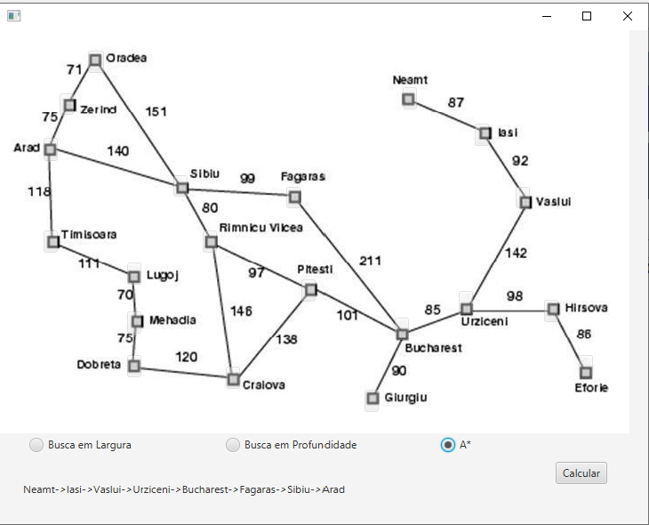

## ProjetoInteligenciaArtificial

#### Miniprojeto apresentado na disciplica de inteligência artificial
* O usuario pode escolher duas cidades e o algoritmo para que o software mostre o caminho mais curto.

##### Segue uma imagem da tela principal:

* 
